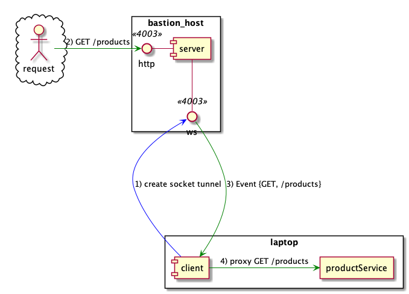
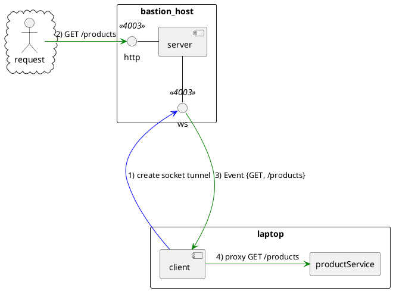

# Design

[Draft]

```plantuml
@startuml img/design.png


rectangle bastion_host {
    component server
    interface http<<4003>>
    interface ws<<4003>>
}

rectangle laptop {
    component client
    agent productService
}

cloud {
    actor request
}

request -[#hidden]r- http
http -r- server
server -d- ws

client --[#blue]u--> ws: 1) create socket tunnel
request -[#green]r-> http: 2) GET /products
ws -[#green]d--> client: 3) Event {GET, /products}
client -[#green]r-> productService: 4) proxy GET /products

@enduml
```